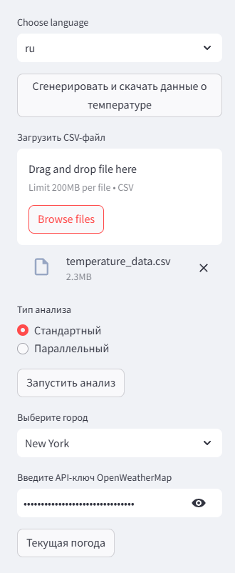

# Streamweather
Streamlit-приложение для анализа погоды.

## Развертывание проекта
```
docker-compose up -d
```

После развертывания приложение будет доступно по адресу http://localhost:8501/.

## Руководство пользователя

### Интерфейс


### Описание интерфейса

**Выпадающий список "Choose language"**  
Позволяет выбрать язык приложения. По умолчанию стоит русский, также доступен английский.

**Кнопка "Сгенерировать и скачать данные о температуре"**  
Генерирует CSV-файл с погодными данными. После успешной генерации появляется кнопка "Скачать CSV", по нажатию на которую происходит скачивание сгенерированного файла.

**Поле "Загрузить CSV-файл""**  
Загружает CSV-файл в память приложения. После загрузки необходимо запустить анализ:
выбрать тип анализа из появившегося списка слева, и нажать кнопку "Запустить анализ".

Типы анализа:
* стандартный - последовательно запускает анализ для всех городов из файла
* параллельный - запускает анализ, распараллеленный с помощью ProcessPoolExecutor (должен выполняться быстрее)

После успешно завершенного анализа будет показано время его выполнения. Анализ можно перезапустить в любой момент.

Анализ включает в себя:
* описательные статистики для температуры
* график временного ряда со скользящим средним, стандартным отклонением, и выделением аномалий
* сезонная статистика
* график сезонных профилей
* анализ трендов (график + показатели)
* таблица аномальных значений

**Выпадающий список "Выберите город"**  
Становится доступен после загрузки файла с данными. После запуска и успешного завершения анализа позволяет просматривать статистику по городу.

**Поле "Введите API-ключ OpenWeatherMap"**  
Требуется для работы кнопки "Текущая погода" (см. ниже).

**Кнопка "Текущая погода"**  
При выбранном городе и корректном API-ключе получает текущую температуру города с OpenWeatherMap API, и проводит проверку на ее аномальность.


## Комментарии по параллельности/асинхронности
* Распараллеливание анализа: из-за небольшого объема вычислений выигрыш от параллельной работы анализа незаметен - при обоих 
способах запуска анализ выполняется в среднем **за одинаковое время**. Ускорение в параллельном анализе будет более 
заметным с ростом объема анализируемых данных.
* Асинхронность получения текущей температуры: данном варианте реализации не требуется, так как в каждый момент времени запрос 
осуществляется только для одного выбранного города
## Известные баги
При добавлении информации о текущей температуре график временного ряда может изменить местоположение и размер.
